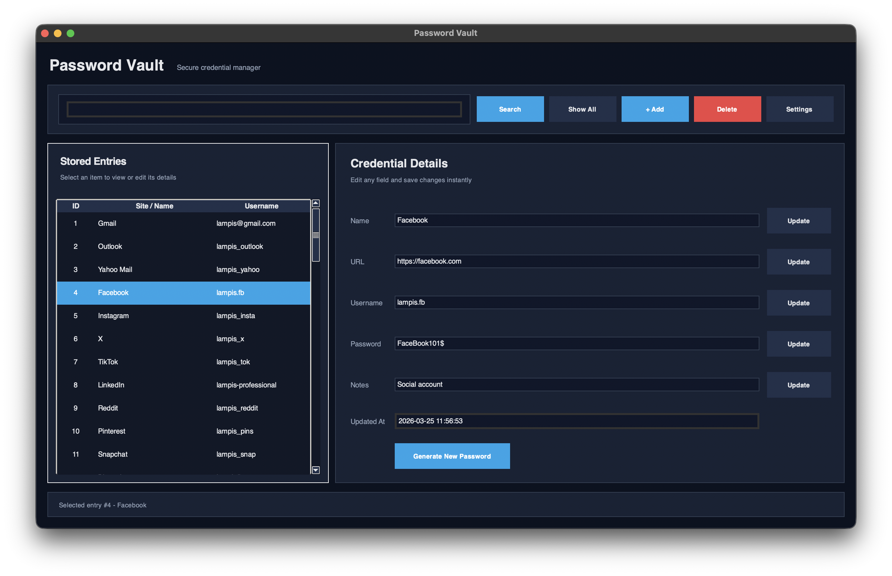
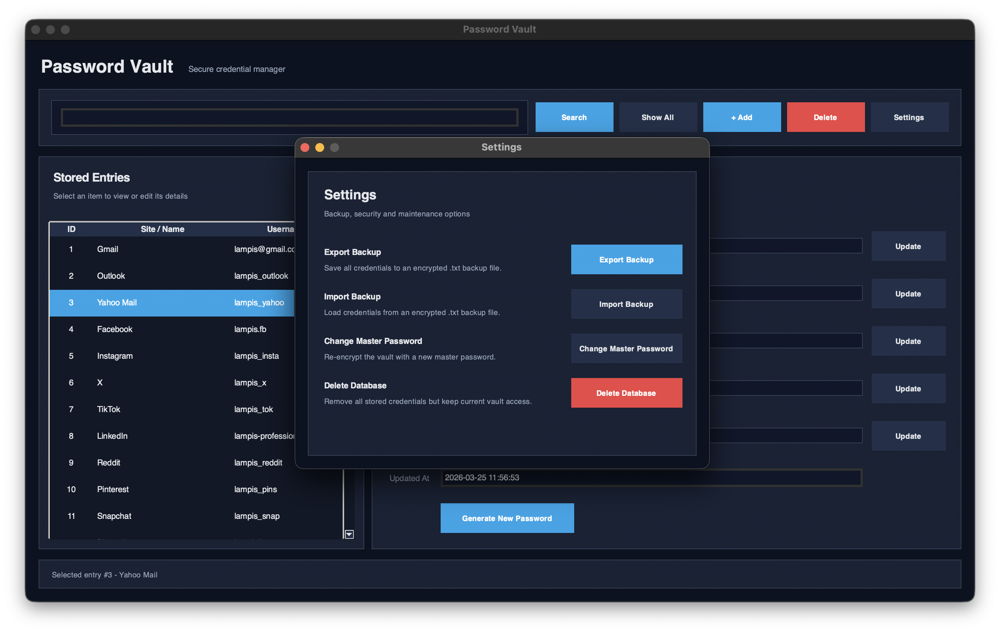
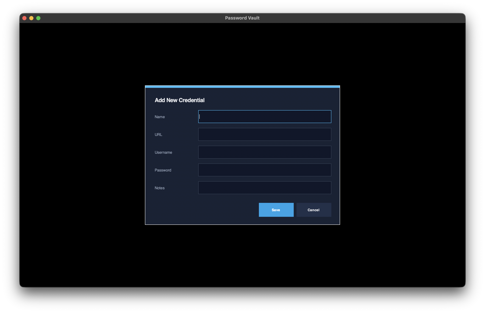
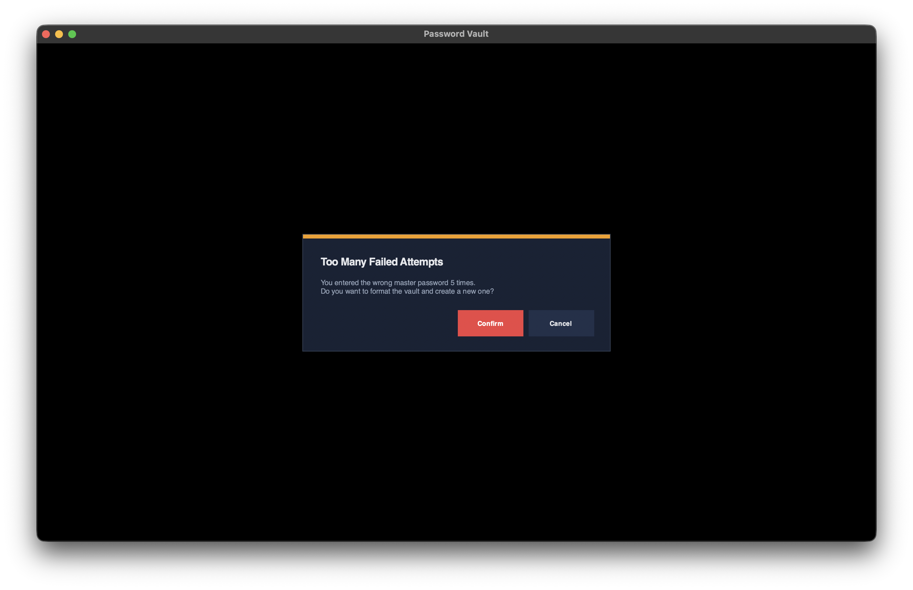
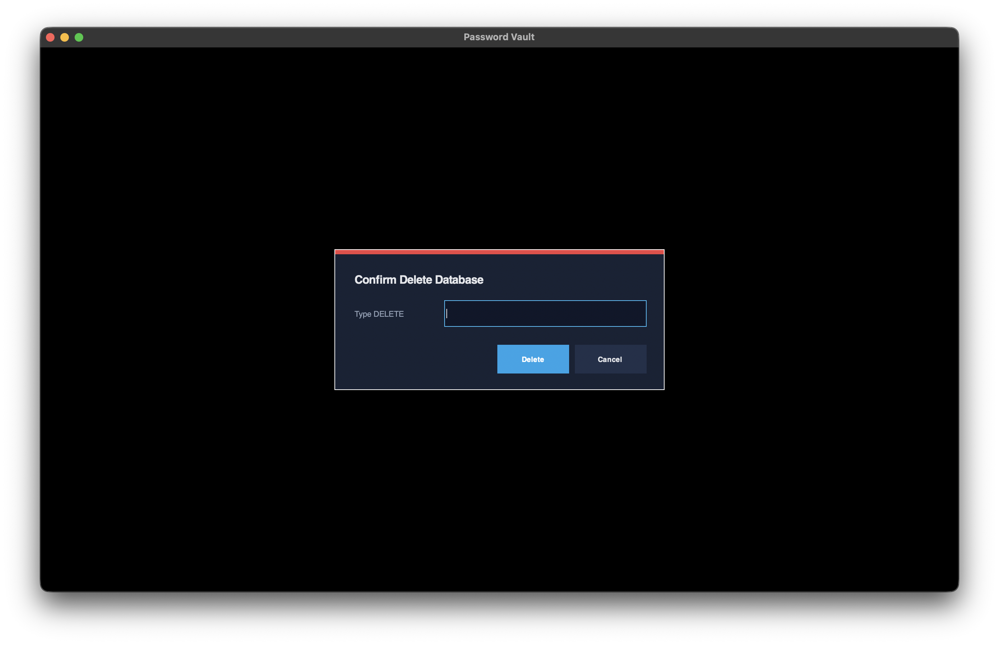

# Password Vault

# Description
PassVault is a secure password manager application that uses encryption and a local SQLite database to store user credentials safely through a graphical user interface. The system allows users to manage their passwords locally, while protecting sensitive information by encrypting stored passwords instead of saving them in plain text.

## Getting Started
### 1) macOS app (`.app`)
- Download **PassVault.zip**
- Unzip the file
- Open the generated **.app** to launch the application directly on macOS

> **Note:** On macOS, the application stores its working files in the **Application Support** directory.

To load the prepared database, open the following path:

`/Users/<your-username>/Library/Application Support/PassVault`

Then copy the files:
- `vault.db`
- `master_config.json`

into that folder. After that, open the application and it will load the ready-made vault data correctly.

**Default master password:** `1234`

**Security note:** If the master password is entered incorrectly 5 times, the application provides the option to **format the database** and start again from the beginning with a new vault setup.

---

### 2) Run from source (Python)
- Download (or clone) the full project folder
- Open a terminal in the project directory
- Run the GUI script:

```bash
python main.py
# or
python3 main.py
```

**Default master password:** `1234`

> **Note:**: When running from source, make sure the files vault.db and master_config.json are placed inside the project folder so the application can load the prepared database correctly.

## User Interface Overview (Screenshots)



The application provides a graphical user interface designed for secure and practical credential management. The main window is organized into sections so that the user can easily browse stored entries, inspect their details, and modify their contents. One part of the interface displays the list of saved credentials, while another shows the full information of the selected entry, including the name, URL, username, password, notes, and the last update timestamp.



At the top of the window, the application includes the main controls for searching entries, displaying all stored credentials, adding new records, deleting selected ones, and accessing the settings window. The interface also supports direct editing of stored values, allowing the user to update credentials immediately. In addition, a password generation feature is available for creating strong random passwords for new or existing entries.



The bottom part of the interface provides a live status area that informs the user about ongoing actions such as loading entries, updating data, importing or exporting backups, and generating passwords. The application also uses notifications to provide immediate feedback. Success notifications confirm completed actions, warning notifications alert the user before sensitive operations, and error notifications appear when an operation fails or invalid input is provided.



For destructive actions such as deleting the database or formatting the vault, the interface requires explicit confirmation. In critical cases, the user must manually type a confirmation word such as `DELETE` or `FORMAT`, which reduces the risk of accidental data loss. Finally, the settings window groups together advanced operations such as encrypted backup export and import, changing the master password, and deleting the database, keeping the main interface cleaner and more organized.


